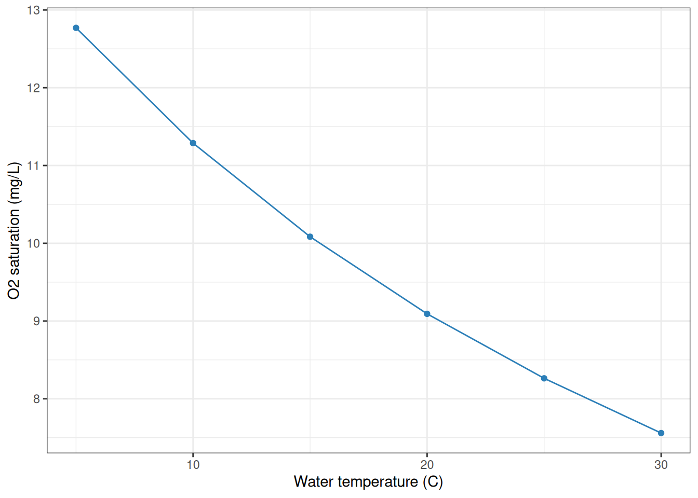

# Chemistry calculations

## Introduction

Stream metabolism workflows often need dissolved gas calculations before
model fitting or quality checks. preMetabolizer includes helpers for
oxygen saturation, CO2 partial pressure, dissolved CO2 concentration,
water vapor pressure, and CO2 solubility.

``` r

library(preMetabolizer)
library(dplyr)
library(ggplot2)
```

## Dissolved oxygen saturation

[`calc_o2_sat()`](https://connorb.github.io/preMetabolizer/reference/calc_o2_sat.md)
calculates dissolved oxygen saturation in mg/L from water temperature,
barometric pressure, pressure units, and optional salinity. This is the
`DO.sat` input commonly used by stream metabolism models.

``` r

water <- tibble::tibble(
  temp_water = seq(5, 30, by = 5),
  atmo_press = 101.325,
  salinity = 0
) |>
  mutate(
    DO_sat_mg_L = calc_o2_sat(
      temp_water = temp_water,
      atmo_press = atmo_press,
      units = "kPa",
      salinity = salinity
    )
  )

water
#> # A tibble: 6 × 4
#>   temp_water atmo_press salinity DO_sat_mg_L
#>        <dbl>      <dbl>    <dbl>       <dbl>
#> 1          5       101.        0       12.8 
#> 2         10       101.        0       11.3 
#> 3         15       101.        0       10.1 
#> 4         20       101.        0        9.09
#> 5         25       101.        0        8.26
#> 6         30       101.        0        7.56
```

Oxygen saturation declines as water warms.

``` r

ggplot(water, aes(temp_water, DO_sat_mg_L)) +
  geom_line(color = "#2c7fb8") +
  geom_point(color = "#2c7fb8") +
  labs(
    x = "Water temperature (C)",
    y = "O2 saturation (mg/L)"
  ) +
  theme_bw()
```



## CO2 partial pressure

[`xco2_to_pco2()`](https://connorb.github.io/preMetabolizer/reference/xco2_to_pco2.md)
converts CO2 mole fraction in air to water-vapor-corrected partial
pressure.
[`pco2_to_xco2()`](https://connorb.github.io/preMetabolizer/reference/pco2_to_xco2.md)
performs the inverse conversion.

``` r

pCO2 <- xco2_to_pco2(
  xco2_ppm = c(420, 800, 1200),
  temp_water = 20,
  atmo_press = 101.325,
  press_units = "kPa",
  salinity = 0,
  method = "MIMSY"
)

pCO2
#> [1]  410.3363  781.5930 1172.3895

pco2_to_xco2(
  temp_water = 20,
  pco2_uatm = pCO2,
  atmo_press = 101.325,
  press_units = "kPa",
  salinity = 0,
  method = "MIMSY"
)
#> [1]  420  800 1200
```

## Dissolved CO2 concentration

[`calc_co2_mol_kg()`](https://connorb.github.io/preMetabolizer/reference/calc_co2_mol_kg.md)
and
[`calc_co2_mg_l()`](https://connorb.github.io/preMetabolizer/reference/calc_co2_mg_l.md)
estimate dissolved CO2 concentration from CO2 mole fraction, water
temperature, water depth, atmospheric pressure, and salinity.

``` r

co2 <- tibble::tibble(
  co2_ppm = c(420, 800, 1200),
  temp_water = 20,
  water_depth_m = 0.5,
  atmo_press = 101.325
) |>
  mutate(
    CO2_mol_kg = calc_co2_mol_kg(
      co2_ppm = co2_ppm,
      temp_water = temp_water,
      water_depth_m = water_depth_m,
      atmo_press = atmo_press,
      press_units = "kPa"
    ),
    CO2_mg_L = calc_co2_mg_l(
      co2_ppm = co2_ppm,
      temp_water = temp_water,
      water_depth_m = water_depth_m,
      atmo_press = atmo_press,
      press_units = "kPa"
    )
  )

co2
#> # A tibble: 3 × 6
#>   co2_ppm temp_water water_depth_m atmo_press CO2_mol_kg CO2_mg_L
#>     <dbl>      <dbl>         <dbl>      <dbl>      <dbl>    <dbl>
#> 1     420         20           0.5       101.  0.0000161    0.706
#> 2     800         20           0.5       101.  0.0000306    1.34 
#> 3    1200         20           0.5       101.  0.0000459    2.02
```

## Vapor pressure and solubility

[`calc_vapor_press()`](https://connorb.github.io/preMetabolizer/reference/calc_vapor_press.md)
returns water vapor pressure in atmospheres. Use `method = "MIMSY"` for
freshwater calculations and `"Dickson2007"` for seawater-style salinity
corrections.
[`calc_k0()`](https://connorb.github.io/preMetabolizer/reference/calc_k0.md)
returns the Weiss (1974) CO2 solubility coefficient.

``` r

temps <- tibble::tibble(temp_water = c(5, 15, 25)) |>
  mutate(
    vapor_press_atm = calc_vapor_press(
      temp_water,
      salinity = 0,
      method = "MIMSY"
    ),
    K0_mol_kg_atm = calc_k0(temp_water, water_depth_m = 0.5)
  )

temps
#> # A tibble: 3 × 3
#>   temp_water vapor_press_atm K0_mol_kg_atm
#>        <dbl>           <dbl>         <dbl>
#> 1          5         0.00831        0.0641
#> 2         15         0.0166         0.0456
#> 3         25         0.0314         0.0341
```

## Combine calculations for model input

The calculations are vectorized, so they fit naturally into a data
preparation pipeline.

``` r

logger <- tibble::tibble(
  dateTime = as.POSIXct(
    c("2024-06-01 00:00:00", "2024-06-01 01:00:00"),
    tz = "UTC"
  ),
  temp_water = c(18.5, 18.2),
  atmo_kpa = c(99.8, 99.7),
  xco2_ppm = c(600, 650)
) |>
  mutate(
    DO.sat = calc_o2_sat(temp_water, atmo_kpa, units = "kPa"),
    pco2_uatm = xco2_to_pco2(
      xco2_ppm = xco2_ppm,
      temp_water = temp_water,
      atmo_press = atmo_kpa,
      press_units = "kPa",
      salinity = 0,
      method = "MIMSY"
    )
  )

logger
#> # A tibble: 2 × 6
#>   dateTime            temp_water atmo_kpa xco2_ppm DO.sat pco2_uatm
#>   <dttm>                   <dbl>    <dbl>    <dbl>  <dbl>     <dbl>
#> 1 2024-06-01 00:00:00       18.5     99.8      600   9.23      578.
#> 2 2024-06-01 01:00:00       18.2     99.7      650   9.27      626.
```
