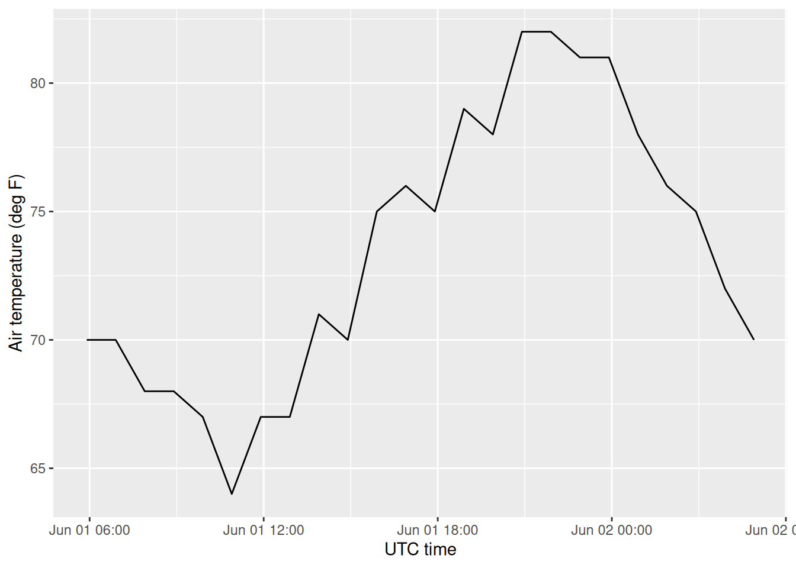

# Working with Iowa Environmental Mesonet data

## Introduction

The [Iowa Environmental Mesonet](https://mesonet.agron.iastate.edu/)
(IEM) provides public access to many meteorological and hydrological
observing networks. IEM groups stations into network identifiers such as
`IA_ASOS`, `IA_COOP`, and many state or special-purpose networks.

preMetabolizer provides helpers for selected IEM API v1 endpoints:

- [`iem_networks()`](https://connorb.github.io/preMetabolizer/reference/iem_networks.md)
  lists available IEM network identifiers.
- [`iem_stations()`](https://connorb.github.io/preMetabolizer/reference/iem_stations.md)
  retrieves station metadata for one network.
- [`iem_station()`](https://connorb.github.io/preMetabolizer/reference/iem_stations.md)
  looks up one station identifier across networks.
- [`iem_current()`](https://connorb.github.io/preMetabolizer/reference/iem_current.md)
  retrieves current observations.
- [`iem_ob_history()`](https://connorb.github.io/preMetabolizer/reference/iem_ob_history.md)
  retrieves one local day of station observations.
- [`iem_daily()`](https://connorb.github.io/preMetabolizer/reference/iem_daily.md)
  retrieves daily summary observations.

> **Note:** These functions contact IEM web services and require an
> internet connection. Code chunks that call the API will not run during
> package installation if the service is unreachable. Run them
> interactively in your own session.

``` r

library(preMetabolizer)
library(dplyr)
library(ggplot2)
```

## Caching downloaded data

Repeated calls to the IEM API download the same data on every run. This
vignette saves each result to a local cache directory the first time it
is downloaded and reloads from disk on subsequent runs. The cache lives
in `tools::R_user_dir("preMetabolizer", which = "cache")`, a
platform-appropriate, user-specific directory that persists across
sessions. Each data-fetching chunk below checks for a cached `.rds`
file, downloads and saves on the first run, and reloads from disk on all
subsequent runs.

## Discover networks and stations

Start with
[`iem_networks()`](https://connorb.github.io/preMetabolizer/reference/iem_networks.md)
when you need to find the exact network identifier for a station source.
The `network` column is the value to pass to other IEM helpers.

``` r

cache_file <- file.path(cache_dir, "iem_networks.rds")
if (!file.exists(cache_file)) {
  networks <- iem_networks()
  saveRDS(networks, cache_file)
} else {
  networks <- readRDS(cache_file)
}

networks |>
  filter(grepl("Iowa", network_name)) |>
  select(network, network_name, tzname)
#> # A tibble: 9 × 3
#>   network     network_name                  tzname         
#>   <chr>       <chr>                         <chr>          
#> 1 IA_ASOS     Iowa ASOS                     America/Chicago
#> 2 IACLIMATE   Iowa Long Term Climate Sites  America/Chicago
#> 3 IA_COCORAHS Iowa CoCoRaHS                 America/Chicago
#> 4 IA_COOP     Iowa COOP                     America/Chicago
#> 5 IA_DCP      Iowa DCP                      America/Chicago
#> 6 IA_HPD      Iowa HPD Sites                America/Chicago
#> 7 IA_RWIS     Iowa RWIS                     America/Chicago
#> 8 ISUAG       Iowa State Univ Ag Climate    America/Chicago
#> 9 ISUSM       Iowa State Univ Soil Moisture America/Chicago
```

Station metadata for a network includes station identifiers, names,
coordinates, archive dates, and the station time zone when IEM provides
it.

``` r

cache_file <- file.path(cache_dir, "iem_stations_ia_asos.rds")
if (!file.exists(cache_file)) {
  ia_asos <- iem_stations("IA_ASOS")
  saveRDS(ia_asos, cache_file)
} else {
  ia_asos <- readRDS(cache_file)
}

ia_asos |>
  select(station_id, station_name, network, tzname, archive_begin, longitude, latitude) |>
  arrange(station_id)
#> # A tibble: 62 × 7
#>    station_id station_name network tzname archive_begin       longitude latitude
#>    <chr>      <chr>        <chr>   <chr>  <dttm>                  <dbl>    <dbl>
#>  1 ADU        AUDUBON      IA_ASOS Ameri… 1994-12-25 00:00:00     -94.9     41.7
#>  2 AIO        ATLANTIC     IA_ASOS Ameri… 1995-04-23 00:00:00     -95.0     41.4
#>  3 ALO        Waterloo     IA_ASOS Ameri… 1949-01-01 00:00:00     -92.4     42.6
#>  4 AMW        Ames         IA_ASOS Ameri… 1996-09-30 00:00:00     -93.6     42.0
#>  5 AWG        WASHINGTON   IA_ASOS Ameri… 1994-12-25 00:00:00     -91.7     41.3
#>  6 AXA        Algona       IA_ASOS Ameri… 1994-12-25 00:00:00     -94.3     43.1
#>  7 BNW        BOONE MUNI   IA_ASOS Ameri… 1995-03-01 00:00:00     -93.8     42.0
#>  8 BRL        BURLINGTON   IA_ASOS Ameri… 1931-09-01 00:00:00     -91.1     40.8
#>  9 CAV        CLARION      IA_ASOS Ameri… 1994-12-25 00:00:00     -93.8     42.7
#> 10 CBF        COUNCIL BLU… IA_ASOS Ameri… 1994-12-25 00:00:00     -95.8     41.3
#> # ℹ 52 more rows
```

Some station identifiers appear in more than one network. Use
[`iem_station()`](https://connorb.github.io/preMetabolizer/reference/iem_stations.md)
when you want to check how IEM resolves a station ID before requesting
data.

``` r

cache_file <- file.path(cache_dir, "iem_station_amw.rds")
if (!file.exists(cache_file)) {
  amw <- iem_station("AMW")
  saveRDS(amw, cache_file)
} else {
  amw <- readRDS(cache_file)
}

amw |>
  select(station_id, station_name, network, tzname, archive_begin)
#> # A tibble: 2 × 5
#>   station_id station_name      network tzname          archive_begin      
#>   <chr>      <chr>             <chr>   <chr>           <dttm>             
#> 1 AMW        Ames              IA_ASOS America/Chicago 1996-09-30 00:00:00
#> 2 AMW        AMES MUNICIPAL AP IA_DCP  America/Chicago 2010-12-28 00:00:00
```

## Retrieve current observations

[`iem_current()`](https://connorb.github.io/preMetabolizer/reference/iem_current.md)
requires at least one filter. You can request all current observations
in a network, stations within a network, stations by forecast office, or
one or more station identifiers.

``` r

cache_file <- file.path(cache_dir, "iem_current_ia_asos.rds")
if (!file.exists(cache_file)) {
  current <- iem_current(network = "IA_ASOS")
  saveRDS(current, cache_file)
} else {
  current <- readRDS(cache_file)
}

current |>
  select(station_id, station_name, utc_valid, tmpf, dwpf, sknt, drct, mslp) |>
  arrange(station_id)
#> # A tibble: 61 × 8
#>    station_id station_name   utc_valid            tmpf  dwpf  sknt  drct  mslp
#>    <chr>      <chr>          <dttm>              <dbl> <dbl> <dbl> <dbl> <dbl>
#>  1 ADU        AUDUBON        2026-07-10 22:15:00  78.8  71.6     5    10   NA 
#>  2 AIO        ATLANTIC       2026-07-10 22:15:00  80.6  71.6     9   360   NA 
#>  3 ALO        Waterloo       2026-07-10 22:20:00  81    72       8    90   NA 
#>  4 AMW        Ames           2026-07-10 21:53:00  82    70       6    20 1013.
#>  5 AWG        WASHINGTON     2026-07-10 22:15:00  NA    NA       4   180   NA 
#>  6 AXA        Algona         2026-07-10 22:15:00  78.8  69.8     3    NA   NA 
#>  7 BNW        BOONE MUNI     2026-07-10 22:15:00  80.6  71.6     3    30   NA 
#>  8 BRL        BURLINGTON     2026-07-10 21:53:00  84    74       3   190 1012 
#>  9 CAV        CLARION        2026-07-10 22:15:00  82.4  73.4     0     0   NA 
#> 10 CBF        COUNCIL BLUFFS 2026-07-10 22:15:00  78.8  73.4     5    10   NA 
#> # ℹ 51 more rows
```

For station-specific work, include both `network` and `stations` so
shared station identifiers do not surprise you.

``` r

cache_file <- file.path(cache_dir, "iem_current_dsm_amw.rds")
if (!file.exists(cache_file)) {
  dsm_current <- iem_current(
    network = "IA_ASOS",
    stations = c("DSM", "AMW"),
    minutes = 120
  )
  saveRDS(dsm_current, cache_file)
} else {
  dsm_current <- readRDS(cache_file)
}

dsm_current |>
  select(station_id, station_name, utc_valid, tmpf, relh, sknt, pres)
#> # A tibble: 1 × 7
#>   station_id station_name utc_valid            tmpf  relh  sknt pres 
#>   <chr>      <chr>        <dttm>              <dbl> <dbl> <dbl> <lgl>
#> 1 AMW        Ames         2026-07-10 21:53:00    82  67.1     6 NA
```

## Retrieve one day of observations

[`iem_ob_history()`](https://connorb.github.io/preMetabolizer/reference/iem_ob_history.md)
returns observations for a single station and local station date. UTC
timestamp columns are parsed as UTC `POSIXct` values. Local timestamp
columns are returned as character values because station time zones vary
across networks.

``` r

cache_file <- file.path(cache_dir, "iem_ob_history_dsm_2024-06-01.rds")
if (!file.exists(cache_file)) {
  obs <- iem_ob_history(
    station = "DSM",
    network = "IA_ASOS",
    date = "2024-06-01"
  )
  saveRDS(obs, cache_file)
} else {
  obs <- readRDS(cache_file)
}

obs |>
  select(utc_valid, local_valid, tmpf, dwpf, sknt, drct, p01_i)
#> # A tibble: 297 × 7
#>    utc_valid           local_valid       tmpf  dwpf  sknt  drct p01_i
#>    <dttm>              <chr>            <dbl> <dbl> <dbl> <dbl> <dbl>
#>  1 2024-06-01 05:00:00 2024-06-01T00:00    NA    NA     5   140    NA
#>  2 2024-06-01 05:05:00 2024-06-01T00:05    NA    NA     5   140    NA
#>  3 2024-06-01 05:10:00 2024-06-01T00:10    NA    NA     5   140    NA
#>  4 2024-06-01 05:15:00 2024-06-01T00:15    NA    NA     5   140    NA
#>  5 2024-06-01 05:20:00 2024-06-01T00:20    NA    NA     5   130    NA
#>  6 2024-06-01 05:25:00 2024-06-01T00:25    NA    NA     5   130    NA
#>  7 2024-06-01 05:30:00 2024-06-01T00:30    NA    NA     5   120    NA
#>  8 2024-06-01 05:35:00 2024-06-01T00:35    NA    NA     5   110    NA
#>  9 2024-06-01 05:40:00 2024-06-01T00:40    NA    NA     4   100    NA
#> 10 2024-06-01 05:45:00 2024-06-01T00:45    NA    NA     5   130    NA
#> # ℹ 287 more rows
```

Hourly or sub-hourly records can be plotted directly after selecting the
variables you need.

``` r

obs |>
  filter(!is.na(tmpf)) |>
  ggplot(aes(utc_valid, tmpf)) +
  geom_line() +
  labs(
    x = "UTC time",
    y = "Air temperature (deg F)"
  )
```



## Retrieve daily summaries

Use
[`iem_daily()`](https://connorb.github.io/preMetabolizer/reference/iem_daily.md)
for daily summary observations. Provide either one `date`, or provide
`year` and optional `month` for a longer request.

``` r

cache_file <- file.path(cache_dir, "iem_daily_dsm_2024-06.rds")
if (!file.exists(cache_file)) {
  dsm_daily <- iem_daily(
    network = "IA_ASOS",
    station = "DSM",
    year = 2024,
    month = 6
  )
  saveRDS(dsm_daily, cache_file)
} else {
  dsm_daily <- readRDS(cache_file)
}

dsm_daily |>
  select(station_id, date, max_tmpf, min_tmpf, precip) |>
  arrange(date)
#> # A tibble: 30 × 5
#>    station_id date       max_tmpf min_tmpf precip
#>    <chr>      <date>        <dbl>    <dbl>  <dbl>
#>  1 DSM        2024-06-01       82       63 0     
#>  2 DSM        2024-06-02       83       63 0     
#>  3 DSM        2024-06-03       88       71 0     
#>  4 DSM        2024-06-04       84       63 0.63  
#>  5 DSM        2024-06-05       85       56 0.0001
#>  6 DSM        2024-06-06       83       62 0     
#>  7 DSM        2024-06-07       83       58 0.02  
#>  8 DSM        2024-06-08       80       59 0     
#>  9 DSM        2024-06-09       84       56 0     
#> 10 DSM        2024-06-10       76       52 0     
#> # ℹ 20 more rows
```

For a one-day network request, omit `station` and supply `date`.

``` r

cache_file <- file.path(cache_dir, "iem_daily_ia_asos_2024-06-01.rds")
if (!file.exists(cache_file)) {
  ia_day <- iem_daily("IA_ASOS", date = "2024-06-01")
  saveRDS(ia_day, cache_file)
} else {
  ia_day <- readRDS(cache_file)
}

ia_day |>
  select(station_id, date, max_tmpf, min_tmpf, precip) |>
  arrange(desc(date))
#> # A tibble: 61 × 5
#>    station_id date       max_tmpf min_tmpf precip
#>    <chr>      <date>        <dbl>    <dbl>  <dbl>
#>  1 ADU        2024-06-01     77       59     0.05
#>  2 AIO        2024-06-01     77       62.6   0   
#>  3 ALO        2024-06-01     78       61     0   
#>  4 AMW        2024-06-01     81       60     0.13
#>  5 AWG        2024-06-01     69.8     59    NA   
#>  6 AXA        2024-06-01     75.2     60.8   0.04
#>  7 BNW        2024-06-01     77       62.6   0.14
#>  8 BRL        2024-06-01     71       57     0.47
#>  9 CAV        2024-06-01     77       60.8  NA   
#> 10 CBF        2024-06-01     77       59    NA   
#> # ℹ 51 more rows
```

## Practical notes

IEM combines many observing networks, and each network can have
different available variables, units, reporting intervals, and station
identifiers. A good workflow is to first inspect
[`iem_networks()`](https://connorb.github.io/preMetabolizer/reference/iem_networks.md)
and
[`iem_stations()`](https://connorb.github.io/preMetabolizer/reference/iem_stations.md),
then request observations from a specific `network` and `station` pair.
