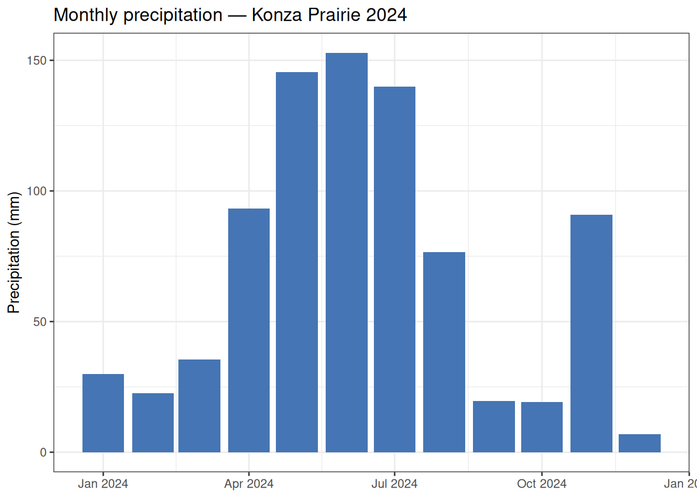

# Downloading Kansas Mesonet data

## Introduction

The [Kansas Mesonet](https://mesonet.k-state.edu/) is a statewide
network of automated weather stations operated by Kansas State
University. It provides sub-hourly meteorological data — including air
temperature, relative humidity, precipitation, solar radiation, wind,
and soil measurements — for more than 60 stations across Kansas.

This vignette walks through the workflow for discovering stations,
browsing the variable catalog, downloading data, and reading cached
files using the preMetabolizer Mesonet functions. We use **Konza
Prairie**, a long-term ecological research (LTER) site in northeastern
Kansas, as our example station.

> **Note:** Functions that contact the Mesonet API require an internet
> connection. Code chunks that call the API will not run during package
> installation if the service is unreachable. Run them interactively in
> your own session.

``` r

library(preMetabolizer)
library(dplyr)
library(ggplot2)
```

## Caching downloaded data

Repeated calls to the Kansas Mesonet API download the same data on every
run. This vignette saves each result to a local cache directory the
first time it is downloaded and reloads from disk on subsequent runs.
The cache lives in
`tools::R_user_dir("preMetabolizer", which = "cache")`, a
platform-appropriate, user-specific directory that persists across
sessions. Each data-fetching chunk below checks for a cached `.rds`
file, downloads and saves on the first run, and reloads from disk on all
subsequent runs.

## Explore the variable catalog

[`ks_meso_vars()`](https://connorb.github.io/preMetabolizer/reference/ks_meso_vars.md)
retrieves and parses the current Kansas Mesonet variable metadata,
including CSV headings, variable names, units, and descriptions.

``` r

cache_file <- file.path(cache_dir, "ks_meso_vars.rds")
if (!file.exists(cache_file)) {
  mesonet_vars <- ks_meso_vars()
  saveRDS(mesonet_vars, cache_file)
} else {
  mesonet_vars <- readRDS(cache_file)
}
```

Search the catalog to find variables of interest:

``` r

mesonet_vars |>
  filter(grepl("temp|precip|solar|humidity", desc, ignore.case = TRUE)) |>
  select(var, tidy_name, units, desc)
#> # A tibble: 44 × 4
#>    var                    tidy_name               units desc                    
#>    <chr>                  <chr>                   <chr> <chr>                   
#>  1 AirTemperature.avg     air_temperature_avg     °C    Average air temperature…
#>  2 AirTemperature.min     air_temperature_min     °C    Min air temperature at …
#>  3 AirTemperature.max     air_temperature_max     °C    Max air temperature at …
#>  4 AirTemperature.smp     air_temperature_smp     °C    Most recent 5 second sa…
#>  5 AirTemperature.10m.avg air_temperature_10m_avg °C    Average air temperature…
#>  6 AirTemperature.10m.min air_temperature_10m_min °C    Min air temperature at …
#>  7 AirTemperature.10m.max air_temperature_10m_max °C    Max air temperature at …
#>  8 RelativeHumidity.avg   relative_humidity_avg   %     Average relative humidi…
#>  9 RelativeHumidity.max   relative_humidity_max   %     Max relative humidity a…
#> 10 RelativeHumidity.min   relative_humidity_min   %     Min relative humidity a…
#> # ℹ 34 more rows
```

## Discover stations

[`ks_meso_stations()`](https://connorb.github.io/preMetabolizer/reference/ks_meso_stations.md)
retrieves metadata for all Mesonet stations, including location, network
affiliation, and whether the station supports FW13 fire weather reports.

``` r

cache_file <- file.path(cache_dir, "ks_meso_stations.rds")
if (!file.exists(cache_file)) {
  stations <- ks_meso_stations()
  saveRDS(stations, cache_file)
} else {
  stations <- readRDS(cache_file)
}

glimpse(stations)
#> Rows: 129
#> Columns: 9
#> $ station_name <chr> "Alma 5SE", "Ashland 8S", "Ashland Bottoms", "Belleville …
#> $ county       <chr> "Waubansee", "Clark", "Riley", "Republic", "Ottawa", "Sed…
#> $ latitude     <dbl> 38.96615, 37.06476, 39.12577, 39.81409, 39.07380, 37.8538…
#> $ longitude    <dbl> -96.20630, -99.75109, -96.63653, -97.67509, -97.58620, -9…
#> $ elevation_m  <dbl> 428.0000, 562.0000, 324.6120, 471.0000, 392.0000, 422.000…
#> $ network      <chr> "KSRE", "KSRE", "KSRE", "KSRE", "KSRE", "KSRE", "KSRE", "…
#> $ station_id   <chr> "Alma 5SE", "ASUK1", "ASBK1", "BVMK1", NA, NA, NA, "EDCK1…
#> $ network_name <chr> "Alma 5SE", "Ashland 8S", "Ashland Bottoms", "Belleville …
#> $ fw13         <chr> "000000", "140201", "142201", "140301", "000000", "000000…
```

Filter to find Konza Prairie and confirm the exact station name used by
the API:

``` r

konza <- stations |>
  filter(grepl("Konza", station_name, ignore.case = TRUE))

konza
#> # A tibble: 1 × 9
#>   station_name  county latitude longitude elevation_m network station_id
#>   <chr>         <chr>     <dbl>     <dbl>       <dbl> <chr>   <chr>     
#> 1 Konza Prairie Riley      39.1     -96.5        436. KSRE    <NA>      
#> # ℹ 2 more variables: network_name <chr>, fw13 <chr>
```

The station name recognized by the API is `"Konza Prairie"`.

## Check station activity

[`ks_meso_station_activity()`](https://connorb.github.io/preMetabolizer/reference/ks_meso_station_activity.md)
shows the observation intervals available at each station and the date
range of archived data. This is useful for verifying that a station has
data for your study period and identifying the finest available temporal
resolution.

``` r

cache_file <- file.path(cache_dir, "ks_meso_station_activity.rds")
if (!file.exists(cache_file)) {
  activity <- ks_meso_station_activity()
  saveRDS(activity, cache_file)
} else {
  activity <- readRDS(cache_file)
}

activity |>
  filter(station_name == "Konza Prairie")
#> # A tibble: 3 × 7
#>   station_name interval interval_seconds first_observation   last_observation   
#>   <chr>        <chr>               <dbl> <dttm>              <dttm>             
#> 1 Konza Prair… 5min                  300 2023-10-06 05:25:00 2026-05-11 11:45:00
#> 2 Konza Prair… hour                 3600 2023-10-06 07:00:00 2026-05-11 11:00:00
#> 3 Konza Prair… day                 86400 2023-10-08 00:00:00 2026-05-11 00:00:00
#> # ℹ 2 more variables: data_span_days <dbl>, is_current <lgl>
```

## Check the most recent observation

[`ks_meso_most_recent()`](https://connorb.github.io/preMetabolizer/reference/ks_meso_most_recent.md)
returns the timestamp of the latest ingested observation for every
station at a given interval, which is helpful for monitoring live data
pipelines.

``` r

cache_file <- file.path(cache_dir, "ks_meso_most_recent_hour.rds")
if (!file.exists(cache_file)) {
  recent <- ks_meso_most_recent(interval = "hour")
  saveRDS(recent, cache_file)
} else {
  recent <- readRDS(cache_file)
}

recent |>
  filter(station_name == "Konza Prairie")
#> # A tibble: 1 × 2
#>   station_name  timestamp          
#>   <chr>         <dttm>             
#> 1 Konza Prairie 2026-05-11 22:00:00
```

## Retrieve time-series data

[`ks_meso_timeseries()`](https://connorb.github.io/preMetabolizer/reference/ks_meso_timeseries.md)
retrieves Mesonet data for one or more stations and returns a tibble
directly. Large date ranges are split into chunks automatically to stay
within the API record limit.

Here we retrieve hourly data for Konza Prairie for the 2024 calendar
year, requesting air temperature, relative humidity, precipitation, and
surface pressure.

``` r

cache_file <- file.path(cache_dir, "ks_meso_konza_hourly_2024.rds")
if (!file.exists(cache_file)) {
  konza_hourly <- ks_meso_timeseries(
    stations   = "Konza Prairie",
    start_date = "2024-01-01",
    end_date   = "2024-12-31",
    interval   = "hour",
    vars       = c("TEMP2MAVG", "RELHUM2MAVG", "PRECIP", "PRESSUREAVG")
  )
  saveRDS(konza_hourly, cache_file)
} else {
  konza_hourly <- readRDS(cache_file)
}

glimpse(konza_hourly)
#> Rows: 8,784
#> Columns: 9
#> $ station_name <chr> "Konza Prairie", "Konza Prairie", "Konza Prairie", "Konza…
#> $ station_id   <chr> NA, NA, NA, NA, NA, NA, NA, NA, NA, NA, NA, NA, NA, NA, N…
#> $ network      <chr> "KSRE", "KSRE", "KSRE", "KSRE", "KSRE", "KSRE", "KSRE", "…
#> $ network_name <chr> "RL.KonzaPrairie", "RL.KonzaPrairie", "RL.KonzaPrairie", …
#> $ timestamp    <dttm> 2024-01-01 00:00:00, 2024-01-01 01:00:00, 2024-01-01 02:…
#> $ pressureavg  <dbl> 97.52, 97.51, 97.51, 97.55, 97.57, 97.55, 97.54, 97.57, 9…
#> $ temp2_mavg   <dbl> -3.67, -3.84, -3.92, -4.12, -3.97, -3.93, -4.17, -4.41, -…
#> $ relhum2_mavg <dbl> 87.35, 88.25, 88.72, 84.79, 81.95, 81.69, 81.83, 83.27, 8…
#> $ precip       <dbl> 0, 0, 0, 0, 0, 0, 0, 0, 0, NA, 0, 0, 0, 0, 0, 0, 0, 0, 0,…
```

## Example workflow: monthly precipitation

With the data in hand, standard `dplyr` and `ggplot2` workflows apply.
The example below summarizes monthly precipitation totals and daily
temperature ranges.

``` r

monthly_precip <- konza_hourly |>
  mutate(month = lubridate::floor_date(timestamp, "month")) |>
  group_by(month) |>
  summarise(
    precip_mm    = sum(precip, na.rm = TRUE),
    temp_mean_C  = mean(temp2_mavg, na.rm = TRUE),
    .groups      = "drop"
  )

ggplot(monthly_precip, aes(month, precip_mm)) +
  geom_col(fill = "#4575b4") +
  labs(
    x = NULL,
    y = "Precipitation (mm)",
    title = "Monthly precipitation — Konza Prairie 2024"
  ) +
  theme_bw()
```



## FW13 fire weather data

[`ks_meso_fw13()`](https://connorb.github.io/preMetabolizer/reference/ks_meso_fw13.md)
retrieves fire weather records in the standard FW13 format used by USDA
Forest Service fire behavior modeling tools.

``` r

cache_file <- file.path(cache_dir, "ks_meso_fw13_konza_2024-04.rds")
if (!file.exists(cache_file)) {
  fw13_records <- ks_meso_fw13(
    station    = "Konza Prairie",
    start_date = "2024-04-01",
    end_date   = "2024-04-30"
  )
  saveRDS(fw13_records, cache_file)
} else {
  fw13_records <- readRDS(cache_file)
}

head(fw13_records, 3)
```
