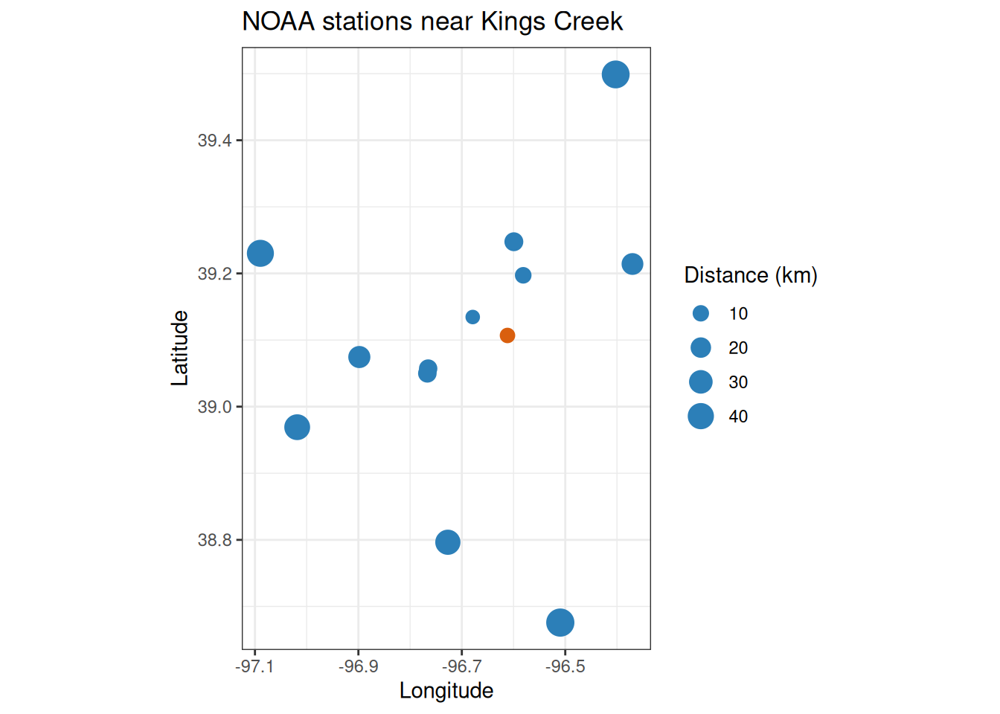
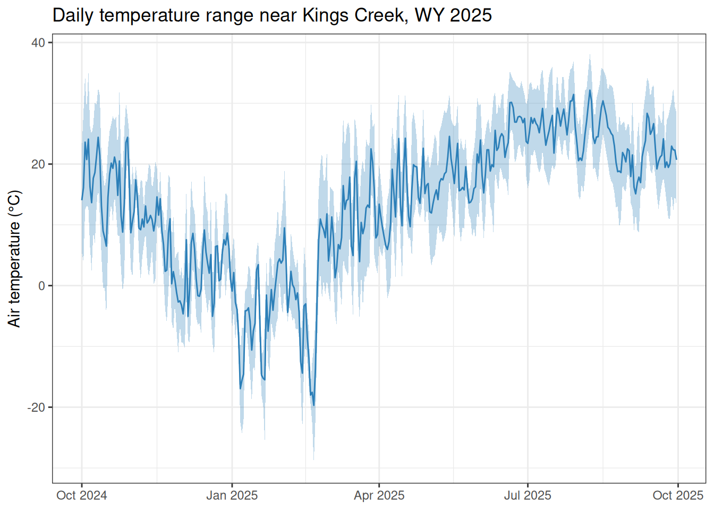

# Finding NOAA stations

## Introduction

Meteorological inputs—temperature, precipitation, and barometric
pressure—are essential for computing dissolved oxygen saturation and gas
exchange in stream metabolism models. This vignette shows how to find
NOAA daily-summary stations near Kings Creek at Konza Prairie Biological
Station, Kansas, and download the weather data needed to accompany the
built-in `kings_discharge` dataset (water year 2025: 2024-10-01 through
2025-09-30).

preMetabolizer provides three helpers for station discovery:

- [`get_noaa_stations()`](https://connorb.github.io/preMetabolizer/reference/get_noaa_stations.md)
  searches for GHCND stations via the NCEI Search Service API.
- [`closest_noaa_stations()`](https://connorb.github.io/preMetabolizer/reference/closest_noaa_stations.md)
  finds stations within a distance of a target coordinate and ranks them
  by geodesic distance.
- [`ncei_stations()`](https://connorb.github.io/preMetabolizer/reference/ncei_stations.md)
  is the lower-level function underlying both helpers; it can search any
  NCEI dataset.

> **Note:** All functions in this vignette contact the NCEI API. Code
> chunks will not run during package installation if NCEI is
> unreachable.

``` r

library(preMetabolizer)
library(dplyr)
library(ggplot2)
```

## Study site

Kings Creek drains the Konza Prairie Biological Station near Manhattan,
Kansas (39.1069°N, 96.6117°W). The USGS monitoring location
`USGS-06879650` records daily discharge, gage height, and water
temperature throughout water year 2025.

``` r

lat_kings  <- 39.1068806
lon_kings  <- -96.6117151
wy_start   <- "2024-10-01"
wy_end     <- "2025-09-30"
```

## Search for stations

Use
[`ncei_bbox()`](https://connorb.github.io/preMetabolizer/reference/ncei_bbox.md)
to build a bounding box from a center point and radius, then pass it to
[`get_noaa_stations()`](https://connorb.github.io/preMetabolizer/reference/get_noaa_stations.md):

``` r

bbox <- ncei_bbox(latitude = lat_kings, longitude = lon_kings, dist_km = 100)
bbox
#>     north      west     south      east 
#>  40.00778 -97.77271  38.20598 -95.45072
```

``` r

ks_stations <- get_noaa_stations(bbox = bbox)

glimpse(ks_stations)
#> Rows: 634
#> Columns: 8
#> $ station_id    <chr> "USW00013996", "USW00013984", "USW00003936", "USW0000391…
#> $ name          <chr> "TOPEKA ASOS, KS US", "CONCORDIA ASOS, KS US", "MANHATTA…
#> $ latitude      <dbl> 39.07246, 39.55127, 39.13456, 38.77996, 38.32906, 38.941…
#> $ longitude     <dbl> -95.62602, -97.65077, -96.67894, -97.64444, -96.19453, -…
#> $ elevation     <dbl> NA, NA, NA, NA, NA, NA, NA, NA, NA, NA, NA, NA, NA, NA, …
#> $ start_date    <date> 1946-08-01, 1885-05-01, 1960-06-01, 1952-01-01, 1950-10…
#> $ end_date      <date> 2026-05-07, 2026-05-07, 2026-05-07, 2026-05-07, 2026-05…
#> $ data_coverage <dbl> NA, NA, NA, NA, NA, NA, NA, NA, NA, NA, NA, NA, NA, NA, …
```

Filter to stations that carry the variables you need and span at least
part of water year 2025:

``` r

wx_stations <- get_noaa_stations(
  bbox       = bbox,
  data_types = c("TMAX", "TMIN", "PRCP"),
  start_date = wy_start,
  end_date   = wy_end
)

wx_stations |>
  select(station_id, name, latitude, longitude, start_date, end_date) |>
  arrange(name)
#> # A tibble: 47 × 6
#>    station_id  name                   latitude longitude start_date end_date  
#>    <chr>       <chr>                     <dbl>     <dbl> <date>     <date>    
#>  1 USC00140010 ABILENE, KS US             38.9     -97.2 1893-01-01 2026-03-31
#>  2 USC00140682 BELLEVILLE, KS US          39.8     -97.6 1935-04-01 2026-05-08
#>  3 USC00140877 BLAINE, KS US              39.5     -96.4 1955-03-02 2026-04-15
#>  4 USC00140911 BLUE RAPIDS, KS US         39.7     -96.7 1905-01-01 2026-05-08
#>  5 USC00141435 CHAPMAN, KS US             39.0     -97.0 1904-02-01 2026-05-08
#>  6 USC00141559 CLAY CENTER, KS US         39.4     -97.1 1902-04-16 2026-05-08
#>  7 USC00141593 CLIFTON, KS US             39.6     -97.3 1931-04-01 2026-04-28
#>  8 USC00141761 CONCORDIA 2 SE, KS US      39.6     -97.6 2003-01-01 2026-04-27
#>  9 USC00141762 CONCORDIA 2 SSE, KS US     39.5     -97.7 2024-03-21 2026-05-07
#> 10 USW00013984 CONCORDIA ASOS, KS US      39.6     -97.7 1885-05-01 2026-05-07
#> # ℹ 37 more rows
```

## Find nearby stations

[`closest_noaa_stations()`](https://connorb.github.io/preMetabolizer/reference/closest_noaa_stations.md)
builds the bounding box automatically and returns stations sorted by
geodesic distance from the target point:

``` r

konza_noaa <- closest_noaa_stations(
  latitude   = lat_kings,
  longitude  = lon_kings,
  dist_km    = 50,
  data_types = c("TMAX", "TMIN", "PRCP"),
  start_date = wy_start,
  end_date   = wy_end
)

konza_noaa |>
  select(distance_km, station_id, name, latitude, longitude)
#> # A tibble: 13 × 5
#>    distance_km station_id  name                               latitude longitude
#>          <dbl> <chr>       <chr>                                 <dbl>     <dbl>
#>  1       0.493 USW00053974 MANHATTAN 6 SSW, KS US                 39.1     -96.6
#>  2       6.58  USW00003936 MANHATTAN ASOS, KS US                  39.1     -96.7
#>  3      10.4   USC00144972 MANHATTAN, KS US                       39.2     -96.6
#>  4      14.4   USC00142827 FORT RILEY, KS US                      39.1     -96.8
#>  5      14.8   USW00013947 FORT RILEY MARSHALL ARMY AIR FIEL…     39.0     -96.8
#>  6      15.7   USC00148259 TUTTLE CREEK LAKE, KS US               39.2     -96.6
#>  7      24.0   USC00148563 WAMEGO 4 W, KS US                      39.2     -96.4
#>  8      25.0   USC00145306 MILFORD LAKE, KS US                    39.1     -96.9
#>  9      35.9   USC00148802 WHITE CITY, KS US                      38.8     -96.7
#> 10      38.4   USC00141435 CHAPMAN, KS US                         39.0     -97.0
#> 11      43.5   USC00148503 WAKEFIELD 4 W, KS US                   39.2     -97.1
#> 12      47.1   USC00140877 BLAINE, KS US                          39.5     -96.4
#> 13      48.7   USC00141867 COUNCIL GROVE LAKE, KS US              38.7     -96.5
```

Map the candidates before choosing a station:

``` r

ggplot(konza_noaa, aes(longitude, latitude)) +
  geom_point(aes(size = distance_km), color = "#2c7fb8") +
  annotate("point", x = lon_kings, y = lat_kings, color = "#d95f0e", size = 3) +
  coord_quickmap() +
  labs(
    x     = "Longitude",
    y     = "Latitude",
    size  = "Distance (km)",
    title = "NOAA stations near Kings Creek"
  ) +
  theme_bw()
```



## Download daily weather data

Pick the nearest station and download daily temperature and
precipitation for water year 2025 with
[`ncei_data()`](https://connorb.github.io/preMetabolizer/reference/ncei_data.md):

``` r

station_id <- konza_noaa |>
  arrange(distance_km) |>
  pull(station_id) |>
  first()

station_id
#> [1] "USW00053974"
```

``` r

daily_wx <- ncei_data(
  dataset    = "daily-summaries",
  stations   = station_id,
  start_date = wy_start,
  end_date   = wy_end,
  data_types = c("TMAX", "TMIN", "PRCP")
)

glimpse(daily_wx)
#> Rows: 365
#> Columns: 6
#> $ STATION <chr> "USW00053974", "USW00053974", "USW00053974", "USW00053974", "U…
#> $ NAME    <chr> "MANHATTAN 6 SSW, KS US", "MANHATTAN 6 SSW, KS US", "MANHATTAN…
#> $ DATE    <date> 2024-10-01, 2024-10-02, 2024-10-03, 2024-10-04, 2024-10-05, 2…
#> $ PRCP    <dbl> 0.0, 0.0, 0.0, 0.0, 0.0, 0.0, 0.0, 0.0, 0.0, 3.7, 0.0, 0.0, 0.…
#> $ TMAX    <dbl> 22.6, 28.4, 34.7, 28.3, 35.4, 26.2, 24.8, 26.5, 30.2, 29.7, 32…
#> $ TMIN    <dbl> 5.5, 3.8, 12.5, 13.2, 12.8, 6.4, 2.5, 8.8, 7.0, 12.9, 16.3, 11…
```

With `units = "metric"` (the default),
[`ncei_data()`](https://connorb.github.io/preMetabolizer/reference/ncei_data.md)
returns TMAX and TMIN in °C and PRCP in mm. The `DATE` column is already
a `Date`:

``` r

ggplot(daily_wx, aes(DATE)) +
  geom_ribbon(aes(ymin = TMIN, ymax = TMAX), alpha = 0.3, fill = "#2c7fb8") +
  geom_line(aes(y = (TMAX + TMIN) / 2), color = "#2c7fb8") +
  labs(
    x     = NULL,
    y     = "Air temperature (°C)",
    title = "Daily temperature range near Kings Creek, WY 2025"
  ) +
  theme_bw()
```



## Barometric pressure and PAR

GHCND covers temperature and precipitation well, but barometric pressure
records are sparse in this region. For pressure and photosynthetically
active radiation (PAR), use
[`get_nasa_data()`](https://connorb.github.io/preMetabolizer/reference/get_nasa_data.md)
to pull modeled values from NASA POWER, or
[`get_ghcnh()`](https://connorb.github.io/preMetabolizer/reference/get_ghcnh.md)
to download observed hourly pressure from the GHCNh archive.

``` r

stream_data <- tibble(
  dateTime = seq(
    as.POSIXct(paste(wy_start, "00:00:00"), tz = "UTC"),
    as.POSIXct(paste(wy_end, "23:00:00"), tz = "UTC"),
    by = "1 hour"
  )
)

nasa_wx <- get_nasa_data(
  data      = stream_data,
  latitude  = lat_kings,
  longitude = lon_kings,
  elev_m    = 320
)

glimpse(nasa_wx)
```

The `PSC` column contains elevation-corrected barometric pressure (kPa),
`light.obs` contains PAR (µmol/m²/s), `T2M` air temperature (°C), and
`PRECTOTCORR` precipitation (mm/hr).

## Use station IDs with GHCNh data

The `station_id` values returned by
[`closest_noaa_stations()`](https://connorb.github.io/preMetabolizer/reference/closest_noaa_stations.md)
also identify GHCNh files. Pass them directly to
[`get_ghcnh()`](https://connorb.github.io/preMetabolizer/reference/get_ghcnh.md):

``` r

station_id
#> [1] "USW00053974"
```

See
[`vignette("ghcnh", package = "preMetabolizer")`](https://connorb.github.io/preMetabolizer/articles/ghcnh.html)
for a full hourly-data workflow.
