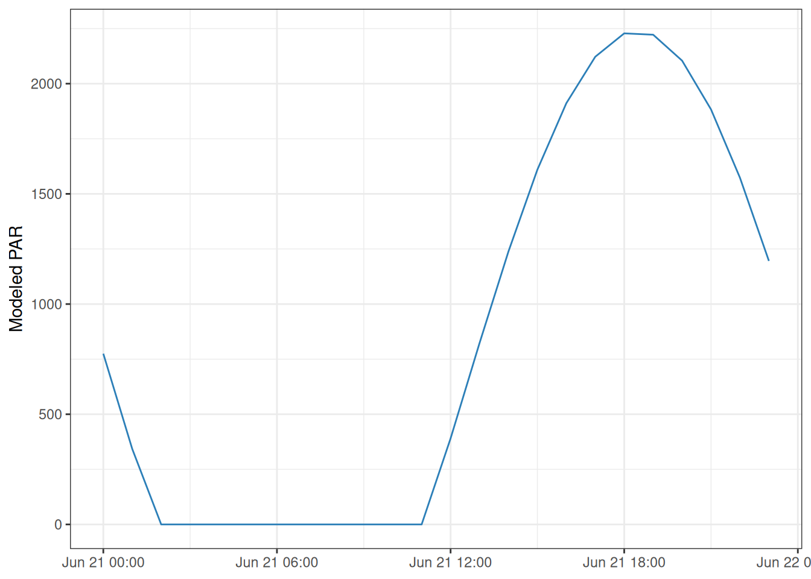

# Physical properties and unit conversions

## Introduction

preMetabolizer includes small physical-property and unit-conversion
helpers for common hydrology and atmospheric science tasks. These
functions return plain numeric vectors, making them easy to use in base
R, dplyr pipelines, and model input tables.

``` r

library(preMetabolizer)
library(dplyr)
library(ggplot2)
```

## Flow conversions

[`convert_flow()`](https://connorb.github.io/preMetabolizer/reference/convert_flow.md)
converts discharge between cubic feet per second (`"cfs"`), cubic meters
per second (`"cms"`), and liters per second (`"lps"`).

``` r

flow <- tibble::tibble(discharge_cfs = c(1, 5, 25, 100)) |>
  mutate(
    discharge_cms = convert_flow(discharge_cfs, from = "cfs", to = "cms"),
    discharge_lps = convert_flow(discharge_cfs, from = "cfs", to = "lps")
  )

flow
#> # A tibble: 4 × 3
#>   discharge_cfs discharge_cms discharge_lps
#>           <dbl>         <dbl>         <dbl>
#> 1             1        0.0283          28.3
#> 2             5        0.142          142. 
#> 3            25        0.708          708. 
#> 4           100        2.83          2832.
```

## Pressure conversions and elevation correction

[`convert_pressure()`](https://connorb.github.io/preMetabolizer/reference/convert_pressure.md)
converts barometric pressure between common units.
[`correct_bp()`](https://connorb.github.io/preMetabolizer/reference/correct_bp.md)
adjusts pressure from a weather station elevation to a site elevation.

``` r

convert_pressure(101.325, from = "kPa", to = "atm")
#> [1] 1
convert_pressure(1013.25, from = "hPa", to = "Pa")
#> [1] 101325

correct_bp(
  station_bp = 101.3,
  air_temp = 15,
  station_elev = 300,
  site_elev = 500,
  from_units = "kPa",
  to_units = "kPa"
)
#> [1] 98.92626
```

Elevation correction is useful when a nearby weather station is not at
the same elevation as a stream site.

``` r

site_pressure <- tibble::tibble(
  station_bp_kPa = c(101.3, 100.9, 100.5),
  air_temp_C = c(15, 17, 18),
  station_elev_m = 300,
  site_elev_m = 500
) |>
  mutate(
    site_bp_kPa = correct_bp(
      station_bp = station_bp_kPa,
      air_temp = air_temp_C,
      station_elev = station_elev_m,
      site_elev = site_elev_m
    )
  )

site_pressure
#> # A tibble: 3 × 5
#>   station_bp_kPa air_temp_C station_elev_m site_elev_m site_bp_kPa
#>            <dbl>      <dbl>          <dbl>       <dbl>       <dbl>
#> 1           101.         15            300         500        98.9
#> 2           101.         17            300         500        98.6
#> 3           100.         18            300         500        98.2
```

## Water density and water height

[`calc_water_density()`](https://connorb.github.io/preMetabolizer/reference/calc_water_density.md)
calculates pure-water density from temperature.
[`calc_water_height()`](https://connorb.github.io/preMetabolizer/reference/calc_water_height.md)
converts pressure-sensor readings into water height.

``` r

temps <- tibble::tibble(water_temp = seq(0, 30, by = 5)) |>
  mutate(density_kg_m3 = calc_water_density(water_temp))

temps
#> # A tibble: 7 × 2
#>   water_temp density_kg_m3
#>        <dbl>         <dbl>
#> 1          0         1000.
#> 2          5         1000.
#> 3         10         1000.
#> 4         15          999.
#> 5         20          998.
#> 6         25          997.
#> 7         30          996.
```

For vented sensors, `sensor_kPa` is already the pressure from the water
column. For unvented sensors, provide atmospheric pressure so it can be
subtracted from the absolute sensor pressure.

``` r

water_level <- tibble::tibble(
  sensor_kPa = c(18.9, 19.2, 19.5),
  atmo_kPa = c(101.1, 101.0, 100.9),
  water_temp = c(14.8, 15.0, 15.2)
) |>
  mutate(
    vented_height_m = calc_water_height(
      sensor_kPa = sensor_kPa,
      water_temp = water_temp,
      type = "vented"
    ),
    unvented_height_m = calc_water_height(
      sensor_kPa = sensor_kPa + atmo_kPa,
      atmo_kPa = atmo_kPa,
      water_temp = water_temp,
      type = "unvented"
    )
  )

water_level
#> # A tibble: 3 × 5
#>   sensor_kPa atmo_kPa water_temp vented_height_m unvented_height_m
#>        <dbl>    <dbl>      <dbl>           <dbl>             <dbl>
#> 1       18.9     101.       14.8            1.93              1.93
#> 2       19.2     101        15              1.96              1.96
#> 3       19.5     101.       15.2            1.99              1.99
```

## Modeled light

[`calc_light()`](https://connorb.github.io/preMetabolizer/reference/calc_light.md)
estimates photosynthetically active radiation (PAR) from solar time and
site coordinates. Input times should be mean solar time.

``` r

utc <- seq(
  as.POSIXct("2024-06-21 00:00:00", tz = "UTC"),
  as.POSIXct("2024-06-21 23:00:00", tz = "UTC"),
  by = "hour"
)

light <- tibble::tibble(
  dateTime_UTC = utc,
  solar_time = convert_UTC_to_solartime(utc, longitude = -96.6)
) |>
  mutate(
    light_PAR = calc_light(
      solar.time = solar_time,
      latitude = 39.1,
      longitude = -96.6
    )
  )

head(light)
#> # A tibble: 6 × 3
#>   dateTime_UTC        solar_time          light_PAR
#>   <dttm>              <dttm>                  <dbl>
#> 1 2024-06-21 00:00:00 2024-06-20 17:34:39      775.
#> 2 2024-06-21 01:00:00 2024-06-20 18:34:39      342.
#> 3 2024-06-21 02:00:00 2024-06-20 19:34:39        0 
#> 4 2024-06-21 03:00:00 2024-06-20 20:34:39        0 
#> 5 2024-06-21 04:00:00 2024-06-20 21:34:39        0 
#> 6 2024-06-21 05:00:00 2024-06-20 22:34:39        0
```

``` r

ggplot(light, aes(dateTime_UTC, light_PAR)) +
  geom_line(color = "#2c7fb8") +
  labs(
    x = NULL,
    y = "Modeled PAR"
  ) +
  theme_bw()
```


