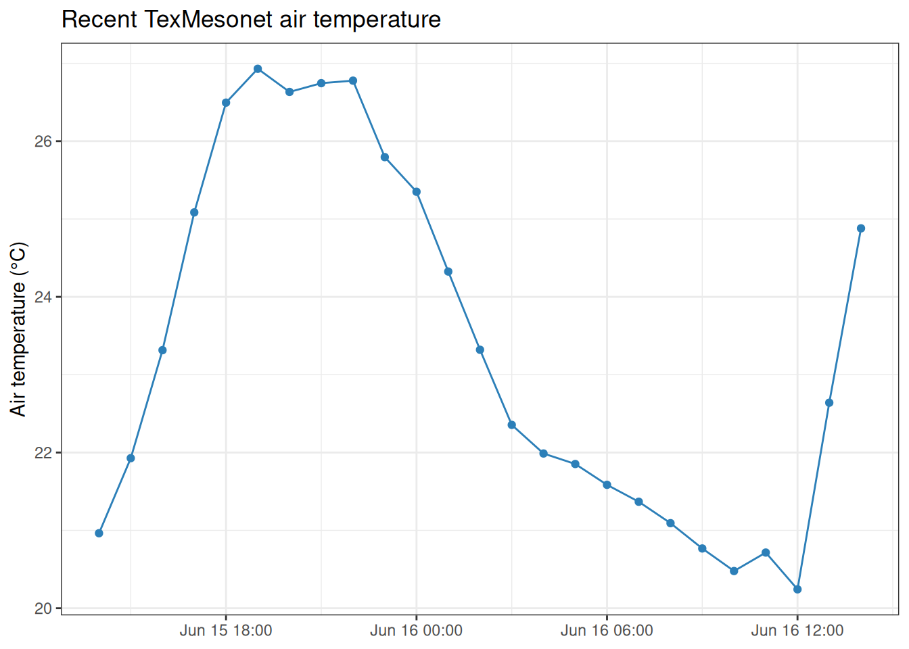

# Working with TexMesonet data

## Introduction

[TexMesonet](https://www.texmesonet.org/) is a statewide earth
observation network managed by the Texas Water Development Board (TWDB).
TWDB stations collect near-real-time weather and soil observations,
including air temperature, humidity, precipitation, wind, solar
radiation, soil temperature, and soil moisture.

preMetabolizer provides three helpers for the public TexMesonet API:

- [`tex_meso_stations()`](https://connorb.github.io/preMetabolizer/reference/tex_meso_stations.md)
  retrieves TWDB station metadata.
- [`tex_meso_current()`](https://connorb.github.io/preMetabolizer/reference/tex_meso_current.md)
  retrieves the most recent observation from each TWDB station.
- [`tex_meso_timeseries()`](https://connorb.github.io/preMetabolizer/reference/tex_meso_timeseries.md)
  retrieves recent time-series observations for one station.

> **Note:** These functions contact the TexMesonet API and require an
> internet connection. Code chunks that call the API will not run during
> package installation if the service is unreachable. Run them
> interactively in your own session.

``` r

library(preMetabolizer)
library(dplyr)
library(ggplot2)
```

## Caching downloaded data

Repeated calls to the TexMesonet API download the same data on every
run. This vignette saves each result to a local cache directory the
first time it is downloaded and reloads from disk on subsequent runs.
The cache lives in
`tools::R_user_dir("preMetabolizer", which = "cache")`, a
platform-appropriate, user-specific directory that persists across
sessions. Each data-fetching chunk below checks for a cached `.rds`
file, downloads and saves on the first run, and reloads from disk on all
subsequent runs.

## Discover TWDB stations

Use
[`tex_meso_stations()`](https://connorb.github.io/preMetabolizer/reference/tex_meso_stations.md)
to retrieve station names, IDs, display IDs, coordinates, elevation,
activity status, and online dates.

``` r

cache_file <- file.path(cache_dir, "tex_meso_stations.rds")
if (!file.exists(cache_file)) {
  stations <- tex_meso_stations()
  saveRDS(stations, cache_file)
} else {
  stations <- readRDS(cache_file)
}

glimpse(stations)
#> Rows: 137
#> Columns: 12
#> $ station_id      <int> 1, 2, 3, 4, 5, 6, 7, 8, 9, 10, 11, 12, 13, 14, 15, 16,…
#> $ station_name    <chr> "Blanco Weather Station", "Altwein Rd", "Headwaters Ra…
#> $ display_id      <chr> "BCBWS", "BCALT", "KEHEA", "BCHOR", "BCARN", "BNLCP", …
#> $ state           <chr> "TX", "TX", "TX", "TX", "TX", "TX", "TX", "TX", "TX", …
#> $ county          <chr> "Blanco", "Blanco", "Kendall", "Blanco", "Blanco", "Ba…
#> $ latitude        <dbl> 30.08906, 30.14957, 30.08845, 30.01853, 30.11047, 29.8…
#> $ longitude       <dbl> -98.41806, -98.54044, -98.69757, -98.45631, -98.30463,…
#> $ elevation       <int> 1334, 1730, 1959, 1416, 1316, 2163, 2206, 1881, 166, 3…
#> $ active          <lgl> FALSE, TRUE, TRUE, TRUE, TRUE, TRUE, TRUE, FALSE, TRUE…
#> $ station_type    <int> 1, 2, 2, 2, 2, 1, 2, 1, 1, 2, 2, 2, 2, 1, 1, 1, 1, 1, …
#> $ station_display <lgl> FALSE, TRUE, TRUE, TRUE, TRUE, TRUE, TRUE, TRUE, TRUE,…
#> $ online_date     <date> 2016-04-28, 2016-04-28, 2016-04-28, 2016-04-28, 2016-…
```

The `active` and `displayed` arguments make it easy to focus on stations
that are currently operating and shown by TexMesonet.

``` r

cache_file <- file.path(cache_dir, "tex_meso_stations_active.rds")
if (!file.exists(cache_file)) {
  active_stations <- tex_meso_stations(active = TRUE, displayed = TRUE)
  saveRDS(active_stations, cache_file)
} else {
  active_stations <- readRDS(cache_file)
}

active_stations |>
  select(station_id, station_name, display_id, county, latitude, longitude) |>
  arrange(county, station_name)
#> # A tibble: 123 × 6
#>    station_id station_name            display_id county  latitude longitude
#>         <int> <chr>                   <chr>      <chr>      <dbl>     <dbl>
#>  1          6 Love Creek Preserve     BNLCP      Bandera     29.8     -99.4
#>  2         69 Phyllis Thomas Bandera  BNPTB      Bandera     29.7     -99.4
#>  3         37 Pecan Grove Farms       BPPGF      Bastrop     30.2     -97.5
#>  4        102 Pawnee Ranch            BEPAW      Bee         28.6     -98.0
#>  5         34 City of Rogers          BLCOR      Bell        30.9     -97.2
#>  6         33 City of Troy            BLCOT      Bell        31.2     -97.3
#>  7         35 Doc Curb Pump Station   BLDOC      Bell        31.0     -97.5
#>  8         36 River Ridge Ranch       BLRRR      Bell        31.0     -97.8
#>  9        107 EAA Field Research Park BXEAA      Bexar       29.7     -98.4
#> 10          2 Altwein Rd              BCALT      Blanco      30.1     -98.5
#> # ℹ 113 more rows
```

For station time-series requests, keep the integer `station_id`. This
example finds stations in Blanco County and selects one station ID for
later use.

``` r

blanco_stations <- active_stations |>
  filter(county == "Blanco") |>
  select(station_id, station_name, display_id, latitude, longitude, elevation)

blanco_stations
#> # A tibble: 4 × 6
#>   station_id station_name         display_id latitude longitude elevation
#>        <int> <chr>                <chr>         <dbl>     <dbl>     <int>
#> 1          2 Altwein Rd           BCALT          30.1     -98.5      1730
#> 2          4 Holt Oaks Ranch      BCHOR          30.0     -98.5      1416
#> 3          5 Arnosky Farms        BCARN          30.1     -98.3      1316
#> 4        108 Blanco Middle School BCMID          30.1     -98.4      1395

site_id <- blanco_stations$station_id[1]
```

## Retrieve current observations

[`tex_meso_current()`](https://connorb.github.io/preMetabolizer/reference/tex_meso_current.md)
returns the most recent available observation from each TWDB station.
Not every station measures every parameter, so some columns may contain
missing values.

``` r

cache_file <- file.path(cache_dir, "tex_meso_current.rds")
if (!file.exists(cache_file)) {
  current <- tex_meso_current()
  saveRDS(current, cache_file)
} else {
  current <- readRDS(cache_file)
}

glimpse(current)
#> Rows: 123
#> Columns: 39
#> $ object_id             <int> 2, 3, 4, 5, 6, 7, 9, 10, 13, 14, 15, 16, 17, 18,…
#> $ station_id            <int> 2, 3, 4, 5, 6, 7, 9, 10, 13, 14, 15, 16, 17, 18,…
#> $ station_name          <chr> "Altwein Rd", "Headwaters Ranch", "Holt Oaks Ran…
#> $ display_id            <chr> "BCALT", "KEHEA", "BCHOR", "BCARN", "BNLCP", "RE…
#> $ latitude              <dbl> 30.14957, 30.08845, 30.01853, 30.11047, 29.80180…
#> $ longitude             <dbl> -98.54044, -98.69757, -98.45631, -98.30463, -99.…
#> $ elevation             <int> 1730, 1959, 1416, 1316, 2163, 2206, 166, 339, 48…
#> $ air_temp              <dbl> 24.93, 23.40, 25.20, 26.43, 24.05, 23.65, 22.29,…
#> $ air_temp2_m           <dbl> 24.93, 23.40, 25.20, 26.43, 24.05, 23.65, 22.29,…
#> $ humidity              <dbl> 80.60, 84.20, 79.88, 79.81, 80.90, 88.40, 97.70,…
#> $ precip                <dbl> 0.000, 0.000, 0.000, 0.000, 0.000, 0.000, NA, 0.…
#> $ precip24_hr           <dbl> 0.254, 0.000, 0.254, 0.000, 5.334, 0.000, 0.000,…
#> $ precip48_hr           <dbl> 90.678, 63.246, 48.006, 59.182, 152.654, 17.018,…
#> $ precip72_hr           <dbl> 90.932, 63.246, 48.006, 59.182, 152.654, 17.018,…
#> $ wind_speed            <dbl> 0.0000, 2.2830, 0.0000, 1.4990, 2.6794, 1.2088, …
#> $ wind_speed2_m         <dbl> 0.0000, 2.2830, 0.0000, 1.4990, 1.6991, 1.2088, …
#> $ wind_direction        <dbl> 280, 36, 57, 89, 24, 13, 83, 44, 29, 326, 0, 41,…
#> $ wind_direction2_m     <dbl> 280, 36, 57, 89, 78, 13, 143, 44, 29, 349, 63, 3…
#> $ wind_gust             <dbl> 0.0000, 4.0082, 0.0000, 2.9430, 3.8318, 3.4756, …
#> $ wind_gust2_m          <dbl> 0.0000, 4.0082, 0.0000, 2.9430, 2.4104, 3.4756, …
#> $ battery_voltage       <dbl> 14.12, 13.99, 13.53, 13.95, 14.19, 13.37, 12.72,…
#> $ soil_moisture         <dbl> 0.337, 0.441, 0.359, 0.556, 0.429, 0.340, 0.109,…
#> $ soil_temperature      <dbl> 26.55, 23.93, 26.11, 25.84, 25.58, 25.61, 26.17,…
#> $ soil_moisture5_cm     <dbl> 0.340, 0.401, 0.350, 0.468, 0.306, 0.166, 0.341,…
#> $ soil_temperature5_cm  <dbl> 24.84, 23.24, 24.71, 31.38, 24.77, 24.81, 26.07,…
#> $ soil_moisture10_cm    <dbl> 0.329, 0.319, 0.420, 0.515, 0.463, 0.239, 0.269,…
#> $ soil_temperature10_cm <dbl> 25.35, 23.33, 25.23, 26.01, 24.75, 25.11, 26.09,…
#> $ soil_moisture20_cm    <dbl> 0.337, 0.441, 0.359, 0.556, 0.429, 0.340, 0.109,…
#> $ soil_temperature20_cm <dbl> 26.55, 23.93, 26.11, 25.84, 25.58, 25.61, 26.17,…
#> $ soil_moisture50_cm    <dbl> 0.325, NA, 0.273, 0.624, NA, NA, 0.218, NA, 0.39…
#> $ soil_temperature50_cm <dbl> 26.69, NA, 25.77, NA, NA, NA, 26.00, NA, 27.50, …
#> $ data_interval_minutes <dbl> 5, 5, 5, 5, 5, 5, 5, 5, 5, 5, 5, 5, 5, 5, 5, 5, …
#> $ recorded_time         <dttm> 2026-06-16 14:10:00, 2026-06-16 14:10:00, 2026-…
#> $ air_temp9_m           <dbl> NA, NA, NA, NA, 22.88, NA, 24.92, NA, NA, 24.20,…
#> $ wind_speed10_m        <dbl> NA, NA, NA, NA, 2.6794, NA, 0.0023, NA, NA, 3.01…
#> $ wind_direction10_m    <dbl> NA, NA, NA, NA, 24, NA, 83, NA, NA, 326, 0, 41, …
#> $ wind_gust10_m         <dbl> NA, NA, NA, NA, 3.8318, NA, 0.0555, NA, NA, 4.05…
#> $ air_pressure          <dbl> NA, NA, NA, NA, 938.5323, NA, 1006.2460, NA, NA,…
#> $ solar_radiation       <dbl> NA, NA, NA, NA, 481.6354, NA, 6.8089, NA, NA, 37…
```

The TexMesonet API reports units in a separate object. preMetabolizer
stores that object as a data-frame attribute.

``` r

attr(current, "units")
#> $air_pressure
#> [1] "Millibars"
#> 
#> $air_temp
#> [1] "Celsius"
#> 
#> $battery_voltage
#> [1] "Volts"
#> 
#> $data_interval
#> [1] "Minutes"
#> 
#> $elevation
#> [1] "Feet"
#> 
#> $precipitation
#> [1] "Millimeters"
#> 
#> $relative_humidity
#> [1] "Percent"
#> 
#> $soil_moisture
#> [1] "Centimeters Cubed per Centimeters Cubed"
#> 
#> $soil_temp
#> [1] "Celsius"
#> 
#> $solar_radiation
#> [1] "Watts per Square Meter"
#> 
#> $wind_speed
#> [1] "Meters per Second"
```

For a quick station check, join current observations to station metadata
or filter directly by `station_id`.

``` r

current |>
  filter(station_id == site_id) |>
  select(
    station_id,
    station_name,
    recorded_time,
    air_temp,
    humidity,
    precip,
    wind_speed,
    air_pressure
  )
#> # A tibble: 1 × 8
#>   station_id station_name recorded_time       air_temp humidity precip
#>        <int> <chr>        <dttm>                 <dbl>    <dbl>  <dbl>
#> 1          2 Altwein Rd   2026-06-16 14:10:00     24.9     80.6      0
#> # ℹ 2 more variables: wind_speed <dbl>, air_pressure <dbl>
```

## Retrieve recent time series

[`tex_meso_timeseries()`](https://connorb.github.io/preMetabolizer/reference/tex_meso_timeseries.md)
retrieves observations for a single station over a look-back window
measured in minutes. By default, `variable = "all"` uses the TexMesonet
charting-fields endpoint and returns all fields available for that
station.

``` r

cache_file <- file.path(cache_dir, "tex_meso_timeseries_blanco.rds")
if (!file.exists(cache_file)) {
  recent <- tex_meso_timeseries(
    site_id = site_id,
    prior_minutes = 24 * 60
  )
  saveRDS(recent, cache_file)
} else {
  recent <- readRDS(cache_file)
}

glimpse(recent)
#> Rows: 96
#> Columns: 27
#> $ air_temp           <dbl> 24.88, 24.03, 23.06, 22.13, 21.34, 20.62, 20.23, 20…
#> $ air_temp9_m        <dbl> NA, NA, NA, NA, NA, NA, NA, NA, NA, NA, NA, NA, NA,…
#> $ humidity           <dbl> 84.0, 87.5, 99.9, 99.9, 99.9, 99.9, 99.9, 99.9, 99.…
#> $ precip             <dbl> 0.000, 0.000, 0.000, 0.000, 0.000, 0.000, 0.000, 0.…
#> $ wind_speed         <dbl> 0, 0, 0, 0, 0, 0, 0, 0, 0, 0, 0, 0, 0, 0, 0, 0, 0, …
#> $ wind_speed2_m      <dbl> 0, 0, 0, 0, 0, 0, 0, 0, 0, 0, 0, 0, 0, 0, 0, 0, 0, …
#> $ wind_speed10_m     <dbl> NA, NA, NA, NA, NA, NA, NA, NA, NA, NA, NA, NA, NA,…
#> $ wind_direction     <dbl> 168, 60, 86, 354, 331, 305, 299, 334, 330, 310, 18,…
#> $ wind_direction2_m  <dbl> 168, 60, 86, 354, 331, 305, 299, 334, 330, 310, 18,…
#> $ wind_direction10_m <dbl> NA, NA, NA, NA, NA, NA, NA, NA, NA, NA, NA, NA, NA,…
#> $ wind_gust2_m       <dbl> 0, 0, 0, 0, 0, 0, 0, 0, 0, 0, 0, 0, 0, 0, 0, 0, 0, …
#> $ wind_gust10_m      <dbl> NA, NA, NA, NA, NA, NA, NA, NA, NA, NA, NA, NA, NA,…
#> $ air_pressure       <dbl> NA, NA, NA, NA, NA, NA, NA, NA, NA, NA, NA, NA, NA,…
#> $ solar_radiation    <dbl> NA, NA, NA, NA, NA, NA, NA, NA, NA, NA, NA, NA, NA,…
#> $ soil_moist5        <dbl> 0.340, 0.340, 0.340, 0.340, 0.341, 0.341, 0.341, 0.…
#> $ soil_moist10       <dbl> 0.329, 0.330, 0.330, 0.330, 0.330, 0.330, 0.330, 0.…
#> $ soil_moist20       <dbl> 0.338, 0.338, 0.338, 0.338, 0.338, 0.338, 0.339, 0.…
#> $ soil_moist50       <dbl> 0.325, 0.326, 0.326, 0.326, 0.326, 0.326, 0.326, 0.…
#> $ soil_temp5         <dbl> 24.81, 24.81, 24.82, 24.84, 24.89, 24.90, 24.93, 25…
#> $ soil_temp10        <dbl> 25.34, 25.37, 25.42, 25.42, 25.48, 25.51, 25.53, 25…
#> $ soil_temp20        <dbl> 26.53, 26.61, 26.60, 26.61, 26.65, 26.68, 26.71, 26…
#> $ soil_temp50        <dbl> 26.68, 26.69, 26.69, 26.68, 26.68, 26.70, 26.70, 26…
#> $ water_level        <dbl> NA, NA, NA, NA, NA, NA, NA, NA, NA, NA, NA, NA, NA,…
#> $ water_temp         <dbl> NA, NA, NA, NA, NA, NA, NA, NA, NA, NA, NA, NA, NA,…
#> $ water_level2       <dbl> NA, NA, NA, NA, NA, NA, NA, NA, NA, NA, NA, NA, NA,…
#> $ water_temp2        <dbl> NA, NA, NA, NA, NA, NA, NA, NA, NA, NA, NA, NA, NA,…
#> $ date_time          <dttm> 2026-06-16 14:00:00, 2026-06-16 13:45:00, 2026-06-…
```

The returned `date_time` column is parsed as UTC.

``` r

range(recent$date_time, na.rm = TRUE)
#> [1] "2026-06-15 14:15:00 UTC" "2026-06-16 14:00:00 UTC"
attr(recent$date_time, "tzone")
#> [1] "UTC"
```

## Retrieve one variable

TexMesonet also provides smaller single-variable endpoints. Use the
`variable` argument when you only need one series.

``` r

cache_file <- file.path(cache_dir, "tex_meso_timeseries_blanco_temperature.rds")
if (!file.exists(cache_file)) {
  temperature <- tex_meso_timeseries(
    site_id = site_id,
    prior_minutes = 24 * 60,
    variable = "temperature"
  )
  saveRDS(temperature, cache_file)
} else {
  temperature <- readRDS(cache_file)
}

temperature |>
  arrange(date_time) |>
  tail()
#> # A tibble: 6 × 2
#>   value date_time          
#>   <dbl> <dttm>             
#> 1    75 2026-06-16 13:45:00
#> 2    76 2026-06-16 13:50:00
#> 3    77 2026-06-16 13:55:00
#> 4    77 2026-06-16 14:00:00
#> 5    77 2026-06-16 14:05:00
#> 6    77 2026-06-16 14:10:00

attr(temperature, "units")
#> [1] "Fahrenheit"
```

Available single-variable values are `"temperature"`, `"humidity"`,
`"barometric_pressure"`, `"precip"`, and `"wind_speed"`.

## Example workflow: station weather summary

The charting-fields endpoint is useful when you want to prepare local
meteorological covariates for a stream site. The example below
summarizes hourly temperature, humidity, precipitation, and wind speed
from the recent station data.

``` r

hourly_weather <- recent |>
  mutate(hour = lubridate::floor_date(date_time, "hour")) |>
  group_by(hour) |>
  summarise(
    air_temp_C = mean(air_temp, na.rm = TRUE),
    humidity_pct = mean(humidity, na.rm = TRUE),
    precip_mm = sum(precip, na.rm = TRUE),
    wind_speed_m_s = mean(wind_speed, na.rm = TRUE),
    .groups = "drop"
  )

hourly_weather
#> # A tibble: 25 × 5
#>    hour                air_temp_C humidity_pct precip_mm wind_speed_m_s
#>    <dttm>                   <dbl>        <dbl>     <dbl>          <dbl>
#>  1 2026-06-15 14:00:00       21.0         99.9         0         0     
#>  2 2026-06-15 15:00:00       21.9         99.8         0         0     
#>  3 2026-06-15 16:00:00       23.3         87.5         0         0     
#>  4 2026-06-15 17:00:00       25.1         77.1         0         0     
#>  5 2026-06-15 18:00:00       26.5         70.7         0         0.0208
#>  6 2026-06-15 19:00:00       26.9         68.5         0         0     
#>  7 2026-06-15 20:00:00       26.6         69.0         0         0     
#>  8 2026-06-15 21:00:00       26.7         73.4         0         0.0446
#>  9 2026-06-15 22:00:00       26.8         70.6         0         0.0567
#> 10 2026-06-15 23:00:00       25.8         78.8         0         0     
#> # ℹ 15 more rows
```

Plotting the recent series can help identify gaps or station behavior
before combining meteorological data with stream logger observations.

``` r

ggplot(hourly_weather, aes(hour, air_temp_C)) +
  geom_line(color = "#2c7fb8") +
  geom_point(color = "#2c7fb8", size = 1.5) +
  labs(
    x = NULL,
    y = "Air temperature (°C)",
    title = "Recent TexMesonet air temperature"
  ) +
  theme_bw()
```



## API scope

These functions use the lightweight TexMesonet API endpoints for TWDB
stations. For historical custom downloads, longer date ranges, or
non-TWDB provider networks shown in the TexMesonet map viewer, use the
TexMesonet Custom Downloads page or the source network recommended by
TWDB.
