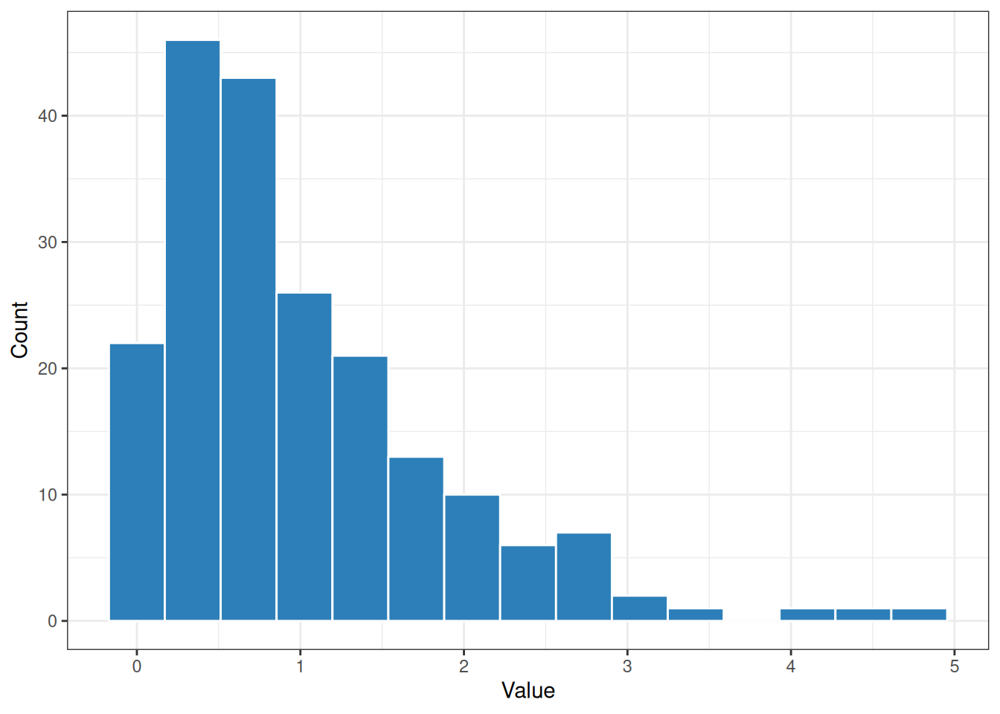
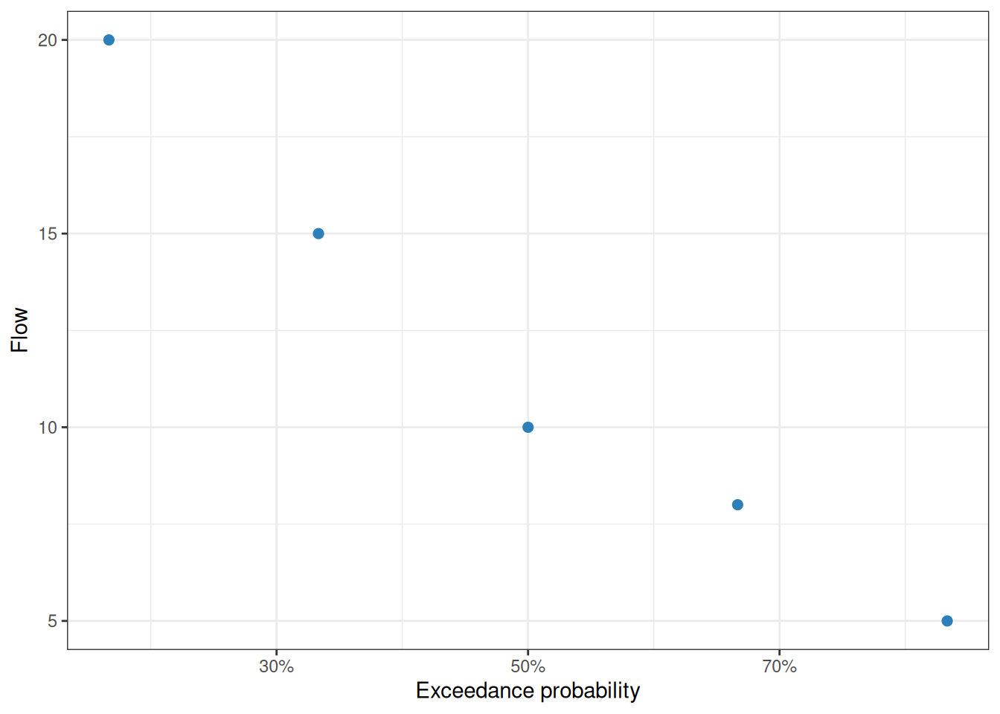

# Time-series and summary utilities

## Introduction

preMetabolizer includes utilities for regularizing logger data,
converting between UTC and solar time, assigning seasons, flagging
outliers, and summarizing variability or flow distributions.

``` r

library(preMetabolizer)
library(dplyr)
library(ggplot2)
```

## Fill missing timesteps

[`even_timesteps()`](https://connorb.github.io/preMetabolizer/reference/even_timesteps.md)
builds a complete timestamp sequence from the observed time step and
inserts rows where observations are missing.

``` r

logger <- tibble::tibble(
  DateTime_UTC = as.POSIXct(
    c(
      "2024-06-01 00:00:00",
      "2024-06-01 01:00:00",
      "2024-06-01 03:00:00"
    ),
    tz = "UTC"
  ),
  temp_water = c(18.1, 18.0, 17.8)
)

even_timesteps(logger)
#> # A tibble: 4 × 2
#>   DateTime_UTC        temp_water
#>   <dttm>                   <dbl>
#> 1 2024-06-01 00:00:00       18.1
#> 2 2024-06-01 01:00:00       18  
#> 3 2024-06-01 02:00:00       NA  
#> 4 2024-06-01 03:00:00       17.8
```

For multi-site data, provide the site column so each site is completed
independently.

``` r

multi_site <- tibble::tibble(
  Site = c("A", "A", "A", "B", "B"),
  DateTime_UTC = as.POSIXct(
    c(
      "2024-06-01 00:00:00",
      "2024-06-01 01:00:00",
      "2024-06-01 03:00:00",
      "2024-06-01 00:00:00",
      "2024-06-01 00:30:00"
    ),
    tz = "UTC"
  )
)

even_timesteps(multi_site, site_col = "Site")
#> # A tibble: 6 × 2
#>   DateTime_UTC        Site 
#>   <dttm>              <chr>
#> 1 2024-06-01 00:00:00 A    
#> 2 2024-06-01 01:00:00 A    
#> 3 2024-06-01 02:00:00 A    
#> 4 2024-06-01 03:00:00 A    
#> 5 2024-06-01 00:00:00 B    
#> 6 2024-06-01 00:30:00 B
```

## Convert UTC and solar time

[`convert_UTC_to_solartime()`](https://connorb.github.io/preMetabolizer/reference/convert_UTC_to_solartime.md)
and
[`convert_solartime_to_UTC()`](https://connorb.github.io/preMetabolizer/reference/convert_solartime_to_UTC.md)
move between UTC and local solar time at a site longitude. Mean solar
time is the time basis expected by stream metabolism models.

``` r

utc <- as.POSIXct("2024-06-21 18:00:00", tz = "UTC")

solar <- convert_UTC_to_solartime(
  utc,
  longitude = -96.6,
  time.type = "mean solar"
)

solar
#> [1] "2024-06-21 11:34:39 UTC"

convert_solartime_to_UTC(
  solar,
  longitude = -96.6,
  time.type = "mean solar"
)
#> [1] "2024-06-21 18:00:00 UTC"
```

## Assign seasons

[`get_season()`](https://connorb.github.io/preMetabolizer/reference/get_season.md)
classifies dates into fixed northern-hemisphere astronomical seasons.

``` r

dates <- as.Date(c(
  "2024-01-15",
  "2024-04-15",
  "2024-07-15",
  "2024-10-15"
))

tibble::tibble(
  date = dates,
  season = get_season(dates)
)
#> # A tibble: 4 × 2
#>   date       season
#>   <date>     <chr> 
#> 1 2024-01-15 Winter
#> 2 2024-04-15 Spring
#> 3 2024-07-15 Summer
#> 4 2024-10-15 Fall
```

## Flag potential outliers

[`flag_z()`](https://connorb.github.io/preMetabolizer/reference/flag_z.md)
applies a moving-window robust Z-score. The default return is a
character flag vector. Set `return_z = TRUE` when you also want the
Z-scores.

``` r

temperature <- c(18.1, 18.2, 18.0, 18.3, 29.9, 18.4, 18.2)

flag_z(temperature, width = 5)
#> [1] NA  NA  NA  NA  "Z" NA  NA

flag_z(temperature, width = 5, return_z = TRUE)
#> $z
#> [1]  0.0000000  0.7428716 -1.4041012  0.0000000 61.4454045  1.1941900 -1.1403570
#> 
#> $flag
#> [1] NA  NA  NA  NA  "Z" NA  NA
```

## Summary statistics

[`calc_cv()`](https://connorb.github.io/preMetabolizer/reference/calc_cv.md)
calculates the coefficient of variation. Use `robust = TRUE` to
summarize relative variability with the median and MAD instead of mean
and standard deviation.

``` r

discharge <- c(0.12, 0.18, 0.15, 1.4, 0.09)

calc_cv(discharge)
#> [1] 146.0615
calc_cv(discharge, robust = TRUE)
#> [1] 20

calc_mode(c("riffle", "run", "riffle", "pool", "run"), multi = "all")
#> [1] "riffle" "run"
```

## Histogram bin widths

[`calc_bin_width()`](https://connorb.github.io/preMetabolizer/reference/calc_bin_width.md)
implements several common histogram rules. This is helpful when plotting
distributions that should use a consistent, data-driven bin width.

``` r

set.seed(1)
values <- stats::rexp(200)

calc_bin_width(values, method = "fd")
#> [1] 0.3417391
calc_bin_width(values, method = "doane")
#> [1] 0.4033973
```

``` r

ggplot(tibble::tibble(values = values), aes(values)) +
  geom_histogram(
    binwidth = calc_bin_width(values, method = "fd"),
    color = "white",
    fill = "#2c7fb8"
  ) +
  labs(x = "Value", y = "Count") +
  theme_bw()
```



## Flow exceedance probabilities

[`calc_exceedance_prob()`](https://connorb.github.io/preMetabolizer/reference/calc_exceedance_prob.md)
ranks flows with the Weibull plotting-position formula. Higher flows
receive lower exceedance probabilities. The C++ implementation,
[`rcpp_calc_exceedance_prob()`](https://connorb.github.io/preMetabolizer/reference/rcpp_calc_exceedance_prob.md),
returns the same shape and is useful for large vectors.

``` r

flows <- tibble::tibble(
  flow_cms = c(10, 5, 0, 15, 8, NA, 0, 20)
) |>
  mutate(
    exceedance = calc_exceedance_prob(flow_cms),
    exceedance_no_zero = rcpp_calc_exceedance_prob(flow_cms, rm.zero = TRUE)
  )

flows
#> # A tibble: 8 × 3
#>   flow_cms exceedance exceedance_no_zero
#>      <dbl>      <dbl>              <dbl>
#> 1       10      0.375              0.5  
#> 2        5      0.625              0.833
#> 3        0      0.812             NA    
#> 4       15      0.25               0.333
#> 5        8      0.5                0.667
#> 6       NA     NA                 NA    
#> 7        0      0.812             NA    
#> 8       20      0.125              0.167
```

``` r

flows |>
  filter(!is.na(exceedance_no_zero)) |>
  ggplot(aes(exceedance_no_zero, flow_cms)) +
  geom_point(color = "#2c7fb8", size = 2) +
  scale_x_continuous(labels = \(x) paste0(round(100 * x), "%")) +
  labs(
    x = "Exceedance probability",
    y = "Flow"
  ) +
  theme_bw()
```


